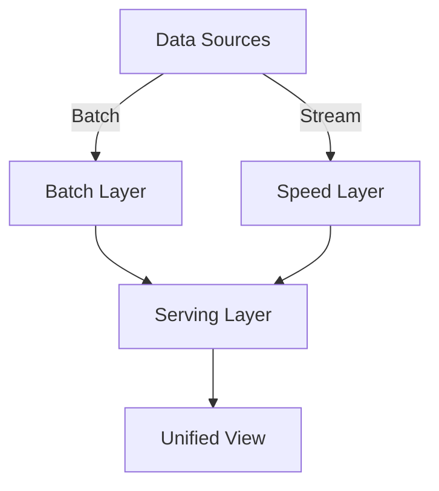

# Lambda Architecture Data Pipeline

A scalable data processing pipeline implementing the Lambda Architecture pattern using Apache Spark, Kafka, and Docker. This project demonstrates how to process both batch and real-time streaming data in a unified architecture.

## 📋 Overview

This project implements a Lambda Architecture with three main layers:

1. **Batch Layer**: Processes large volumes of historical data
2. **Speed Layer**: Handles real-time streaming data
3. **Serving Layer**: Merges batch and real-time views for querying

## 🏗️ Architecture



## 🛠️ Prerequisites

- Docker and Docker Compose
- Python 3.9+
- Java 11 or later

## 🚀 Getting Started

### 1. Clone the Repository

```bash
git clone https://github.com/ayoub0030/BD-Tp1-simulation-spark-pipeline.git
cd BD-Tp1-simulation-spark-pipeline
```

### 2. Build and Start Services

Start all services using Docker Compose:

```bash
docker-compose up -d --build
```

This will start:
- Zookeeper
- Kafka
- Spark Master & Worker
- Jupyter Notebook
- Data Pipeline Service

### 3. Generate Sample Data

#### Batch Data

```bash
docker-compose exec pipeline python lambda_pipeline/make_batch_data.py
```

#### Stream Data

Start the Kafka stream producer:

```bash
docker-compose exec pipeline python lambda_pipeline/stream_generator.py
```

### 4. Run Batch Processing

```bash
docker-compose exec spark-master spark-submit /app/lambda_pipeline/batch_job.py
```

### 5. Run Stream Processing

In a new terminal:

```bash
docker-compose exec spark-master spark-submit /app/lambda_pipeline/speed_job.py
```

### 6. Access Services

- **Jupyter Notebook**: http://localhost:8888 (password: `password`)
- **Spark UI**: http://localhost:8080
- **Kafka UI**: http://localhost:3030 (if Kafka UI is added to compose)

## 📂 Project Structure

```
lambda_pipeline/
├── data/                   # Input data directories
│   ├── batch_input/       # Batch input data
│   └── stream_input/      # Stream input data
├── serving/               # Processed output
│   ├── batch/            # Batch processing results
│   ├── speed/            # Speed layer results
│   └── view/             # Merged views
├── make_batch_data.py     # Generate sample batch data
├── stream_generator.py    # Generate streaming data
├── batch_job.py          # Batch processing job
├── speed_job.py          # Speed layer processing
├── merge_view.py         # Merge batch and speed results
├── requirements.txt      # Python dependencies
└── docker-compose.yml    # Container orchestration
```

## 🧪 Testing

Run the test suite:

```bash
pytest tests/
```

## 🤝 Contributing

1. Fork the repository
2. Create your feature branch (`git checkout -b feature/AmazingFeature`)
3. Commit your changes (`git commit -m 'Add some AmazingFeature'`)
4. Push to the branch (`git push origin feature/AmazingFeature`)
5. Open a Pull Request

## 📄 License

This project is licensed under the MIT License - see the [LICENSE](LICENSE) file for details.

## 🙏 Acknowledgments

- Apache Spark
- Apache Kafka
- Docker
- Python
